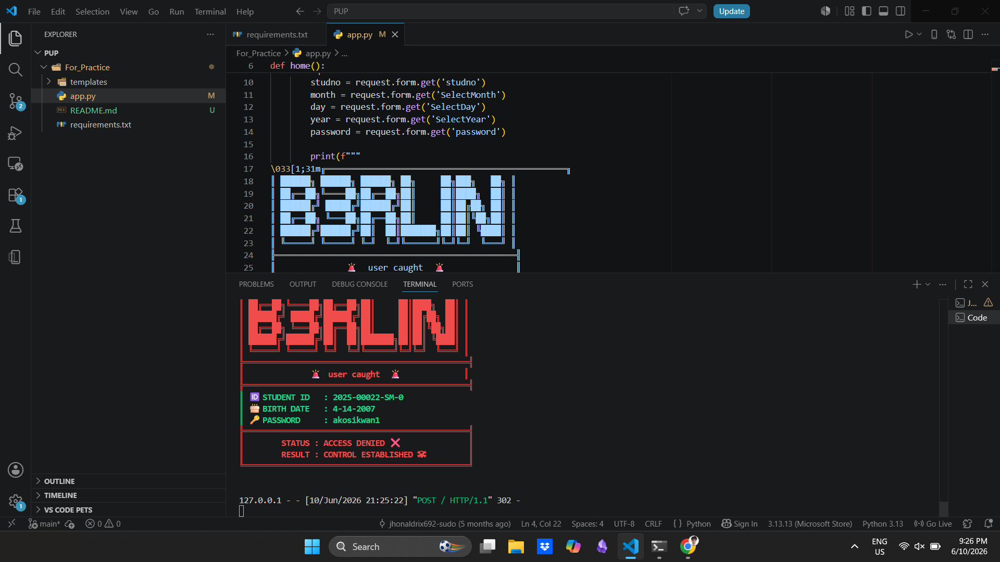

# Flask Project

## Installation

### 1. Clone or Download the Project

```bash
git clone <repository-url>
cd <project-folder>
```

Or download the ZIP file and extract it.

### 2. Create a Virtual Environment (Recommended)

Windows:

```bash
python -m venv venv
venv\Scripts\activate
```

Linux/macOS:

```bash
python3 -m venv venv
source venv/bin/activate
```

### 3. Install Requirements

```bash
pip install -r requirements.txt
```

If you only use Flask:

```bash
pip install Flask
```

If you use ngrok integration:

```bash
pip install Flask flask-ngrok
```

### 4. Run the Application

```bash
python app.py
```

The application will be available at:

```
http://127.0.0.1:5000
```

## Project Structure

```
project/
│
├── app.py
├── requirements.txt
├── README.md
│
├── templates/
│   └── form.html
│
└── static/
```

## Generate Requirements File

If you install additional packages and want to regenerate `requirements.txt`:

```bash
pip freeze > requirements.txt
```

## Notes

* Python 3.10+ is recommended.
* Ensure the `templates` folder contains `form.html`.
* If using ngrok manually:

```bash
ngrok http 5000
```


